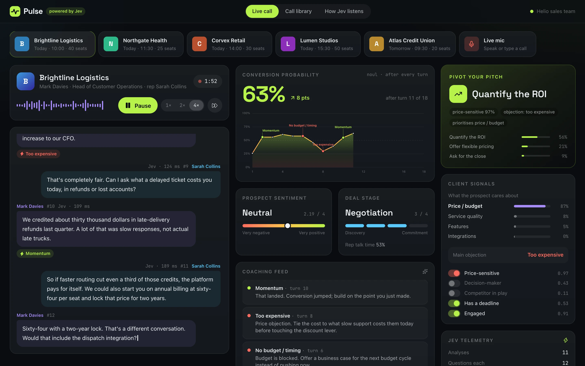
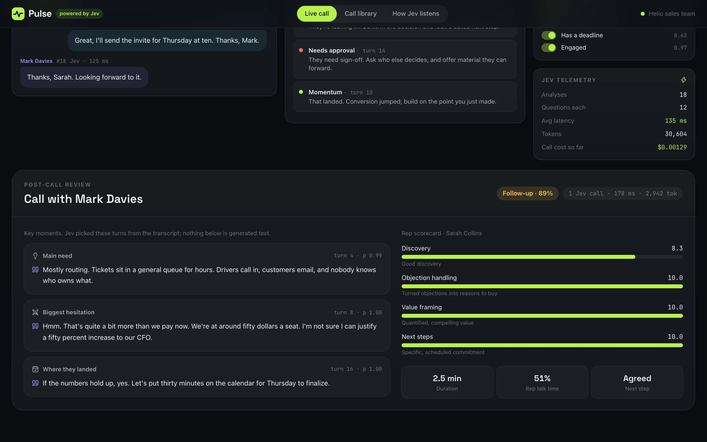
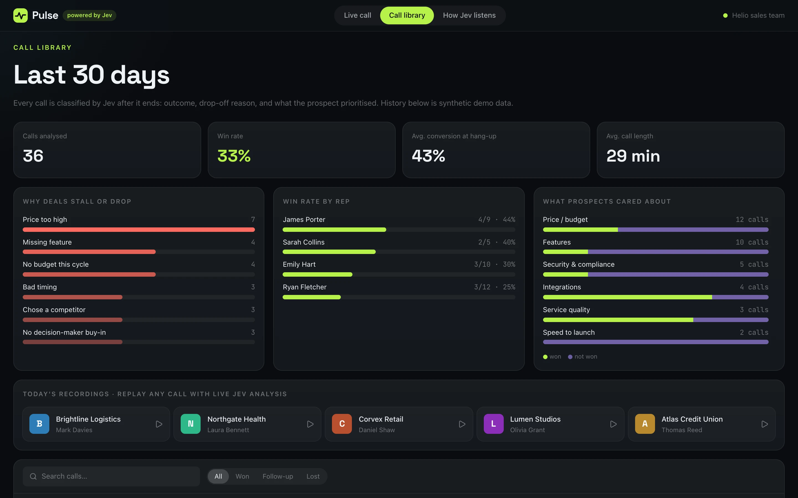
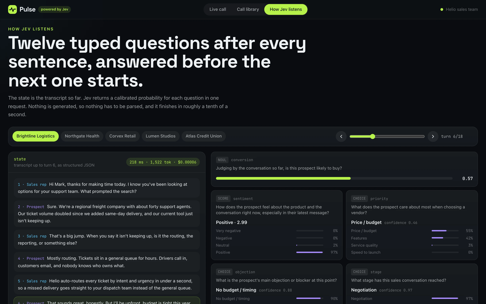

<!-- hero -->
<div align="center">

# Pulse

**Live sales call intelligence with Jev**

Live sales-call intelligence. Jev reads the transcript after every sentence and answers 12 questions before the next one starts.

    -7c3aed)



<sub>Live call: conversion probability, signals and coaching, updated each turn</sub>

</div>

## Screenshots

| | |
|---|---|
|  |  |
| <sub>Post-call review: key moments and the rep scorecard</sub> | <sub>Call library: why deals stall, win rate by rep</sub> |
|  | |
| <sub>How Jev listens: every question, every probability</sub> | |

## About

A real-time sales call console. As the conversation unfolds, **TypeSafe's Jev** reads the transcript after every
sentence and answers 12 typed questions: how likely the prospect is to buy, how they feel, what they care about (price vs.
service quality vs. security…), their main objection, the deal stage, and the best next move for the rep. Each analysis
comes back in ~70–200 ms, before the next sentence is finished.

## Run it

```bash
npm install
cp .env.example .env.local   # add your TYPESAFE_API_KEY
npm run dev                  # http://localhost:3000
```

## Pages

- **Live call**: pick one of five scripted calls (price pivot, healthcare security review, lost to a competitor, fast
  launch win, no budget) and press *Start call*. The transcript streams word by word at 1×/2×/4× speed while Jev updates:
  - conversion probability with a timeline that pins key moments (objections, competitor mentions, buying signals)
  - **Pivot your pitch**: Jev's next-best-action Choice with its top alternatives and the signals behind it
  - client signals: priority distribution, main objection, price-sensitive / decision-maker / competitor / deadline flags
  - sentiment, deal stage, rep talk time, a coaching feed, and live telemetry (latency, tokens, cost)
  - **post-call review**: outcome, drop-off reason, rep scorecard, and three key moments that Jev *picks* from the
    transcript (an extractive summary, no generated text)
- **Live mic**: speak (Chrome speech recognition) or type both sides of your own call and get the same analysis.
- **Call library**: 30 days of call outcomes, drop-off reasons, win rate by rep and by what prospects prioritised
  (synthetic history), plus one-click replays of today's calls.
- **How Jev listens** (`/#how-jev-listens`): scrub to any turn and see the exact state and all 12 questions with their
  probability distributions; then "Analyse all turns" to see real-time headroom: measured Jev latency vs. a projected LLM
  (~3.8 s per analysis) that falls behind the conversation.

## Code map

- `src/lib/questions.ts`: every question, criteria and rubric sent to Jev
- `src/lib/analyze.ts`: one request per turn (12 questions fanned out) and one post-call request (outcome, drop-off,
  key-moment Choices over the prospect's turns, 4-part rep scorecard)
- `src/lib/events.ts`: turns consecutive readings into timeline moments and coaching nudges, in plain code
- `src/lib/calls.ts`: the five scripted calls and the synthetic call history
